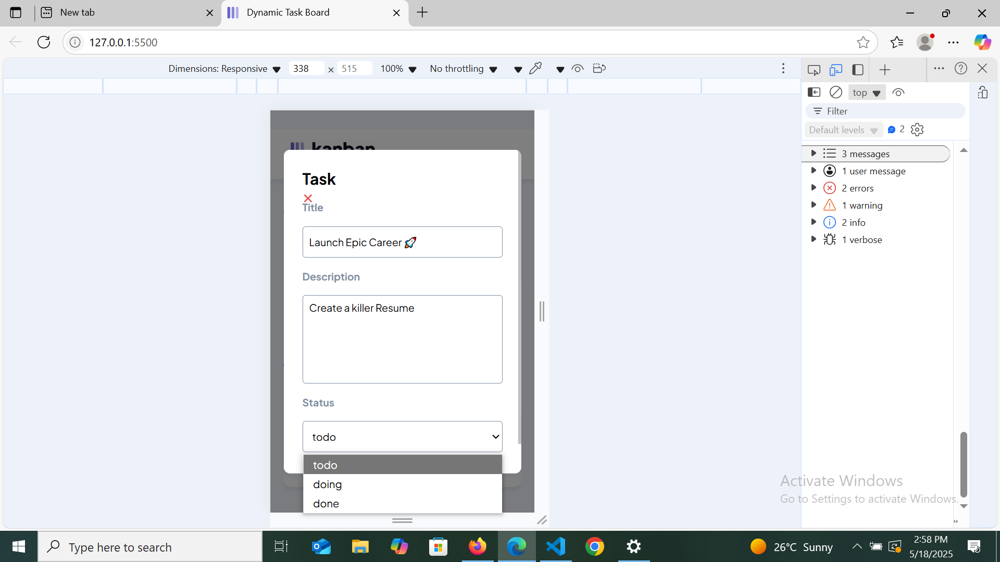

# Dynamic Task Display & Modal View

## Overview

A clean and responsive Kanban-style task board built using HTML, CSS, and JavaScript. This project focuses on dynamically displaying tasks and allowing users to view each task's details in a modal (popup) window.

Everything you see on the page is **generated with JavaScript** — nothing is hardcoded into the HTML.

## Features

- **Three task columns:** To Do, Doing, and Done
- **Modal popup** to view task details
- **Click any task** to open its details
- Allows modal to be closed by clicking the red **"X"** or clicking outside the modal (on the background)
- Supports future dynamic task additions and updates without changing HTML
- Fully **responsive layout** for desktop and mobile
  
## Technologies Used

- HTML - Basic page structure
- CSS - Styling and responsive layout
- JavaScript - Dom manipulation and interactivity

## Challenges Faced

- Dynamically displaying tasks without hard-coding them into the HTML — Solved by using JavaScript to create and insert elements into the DOM at runtime.
- Ensuring responsive interaction for all devices and screen sizes — Solved by writing flexible CSS and testing across different screen   sizes.

### Main Challenge (Unresolved)
- **Issue:**In Google Chrome (particularly on mobile view), the status dropdown overlaps the input area instead of appearing below it. However, the same dropdown works correctly in Microsoft Edge, where it drops down as expected.

- **Status:**This issue is currently unresolved and appears to be browser-specific. Screenshots are included below for reference

**Chrome:below**

  

**Microsoft Edge:below**

  

## Setup Instructions

1. **Download or clone the repository**
     Click the green **Code** button and choose **Download ZIP**, or use Git to clone it.
2. **Open the project folder** on your computer.
3. **Run the project** in any modern web browser.

## How to Use

1. Tasks are automatically shown when the page loads.
2. Click on any task card to open a modal with its details.
3. Modal shows the title, description, and status of the task.
4. To close the modal, click outside of it or click the "X" close button.

## How It Works

- The HTML file includes only a basic layout.
- All tasks and UI elements are created dynamically using JavaScript.
- CSS is used to style the board and make it responsive.
- The modal is shown/hidden using JavaScript event listeners.

## Contact

[Runyararo Marongwe/mrunya87@gmail.com] [https://github.com/Rue87]

